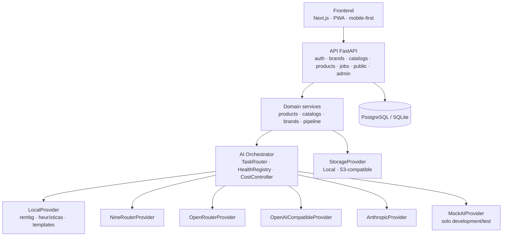

# Arquitectura

## Visión general



Capas (sin DDD estricto, pero sin lógica de negocio en rutas):

```
api/        rutas HTTP, validación de entrada, códigos de estado
services/   lógica de dominio (products, catalogs, brands, auth, pipeline IA, catálogo público)
ai/         orquestador, router, health, cost, prompts, tasks, providers
models/     SQLAlchemy
schemas/    Pydantic (entrada/salida)
core/       config, db, security, logging, rate limit
```

## Frontend

Next.js App Router. Rutas autenticadas bajo un *app shell* con navegación inferior móvil;
`/c/{slug}` es el catálogo público renderizado por `CatalogRenderer` con temas
(`minimal`, `editorial`, `street`, `premium`, `colorful`) definidos como templates frontend.
El frontend nunca conoce proveedores de IA: solo ve productos, jobs y estados.

## Backend

FastAPI + SQLAlchemy 2 + Alembic. Las tareas de IA se ejecutan con `BackgroundTasks`
(suficiente para bajo volumen; `AIJob` guarda estado y progreso; el frontend consulta `GET /jobs/{id}`
o el estado del producto). Migrar a Celery + Redis solo requiere cambiar el despachador en
`api/v1/products.py::_start_job`.

## Dominio

| Entidad | Notas |
|---|---|
| User | JWT (HS256), bcrypt |
| Brand | slug único, WhatsApp, colores, estilo de catálogo; crea un catálogo por defecto |
| Catalog | slug único público, `status` draft/published/archived, `theme` |
| Product | atributos (category, color, fit…), precio, stock (`stock_mode`: tracked/unlimited/out_of_stock), `primary_asset_type` elige la imagen del catálogo |
| ProductAsset | colección de assets por producto: ORIGINAL · CLEAN · MODEL · LIFESTYLE · VIDEO · THUMBNAIL. El original nunca se destruye |
| ProductVariant | talla/color/stock/sku |
| AIJob | PENDING → RUNNING → COMPLETED/FAILED; idempotente por (producto, tarea) |
| AIUsage | costo, latencia, éxito, fallback por solicitud |
| ProviderConfig | enabled/priority editable desde `/admin/ai` sin tocar código |

## Capa de IA

```
ProductService ──► AIOrchestrator.run(task, payload)
                      │
                      ├─ TaskHandler (build_request → parse/validate/normalize)
                      ├─ TaskRouter  (candidatos por tarea, scoring, overrides DB)
                      ├─ HealthRegistry (circuit breaker, estados HEALTHY/DEGRADED/DOWN/QUOTA_EXCEEDED/DISABLED)
                      └─ usage_sink  (ai_usage)
```

- `score = cost×0.40 + quality×0.30 + availability×0.20 + latency×0.10`
- Reintento (1) solo en errores transitorios: timeout, 429, 502, 503. Nunca en 400/401.
- Tras 3 fallos consecutivos el provider queda DOWN 120 s; QUOTA/401 lo apagan 1 h.
- La salida del modelo siempre pasa por `parse → validate (Pydantic) → normalize`.
  Si no valida, se prueba el siguiente provider.
- Prompts versionados en `ai/prompts/registry.py` (`prompt_version` se registra en logs).

## Pipeline visual

```
ORIGINAL → VALIDATION (MIME/bytes/dimensiones/EXIF) → THUMBNAIL
        → PRODUCT_RECOGNITION → PRODUCT_NAME → PRODUCT_DESCRIPTION
        → BACKGROUND_REMOVAL → CLEAN
        → (opcional, deshabilitado) VIRTUAL_MODEL → MODEL → PRODUCT_VIDEO
```

Nunca se bloquea la publicación: si falla la descripción se usa `nombre + atributos`;
si falla el reconocimiento el usuario completa a mano; si no hay CLEAN se publica ORIGINAL.

## Almacenamiento

`StorageProvider` abstracto con `LocalStorageProvider` (sirve `/media`) y
`S3CompatibleProvider` (boto3 opcional). Claves: `products/{id}/{tipo}.{ext}`.

## Seguridad

JWT, bcrypt, rate limiting (slowapi), validación Pydantic, validación de imágenes por contenido,
CORS configurable, logs estructurados con redacción de claves sensibles. En producción se exige
`SECRET_KEY` y se desactivan mocks.

## Decisiones

- **Sync SQLAlchemy + async providers**: simplifica Alembic/tests; los jobs abren su propia sesión.
- **BackgroundTasks antes que Celery**: volumen bajo; Redis queda como perfil opcional en compose.
- **Heurística local de color**: garantiza que el reconocimiento nunca falle del todo (confianza baja).
- **Enums almacenados por valor** (`str_enum`) para portabilidad entre SQLite y PostgreSQL.
